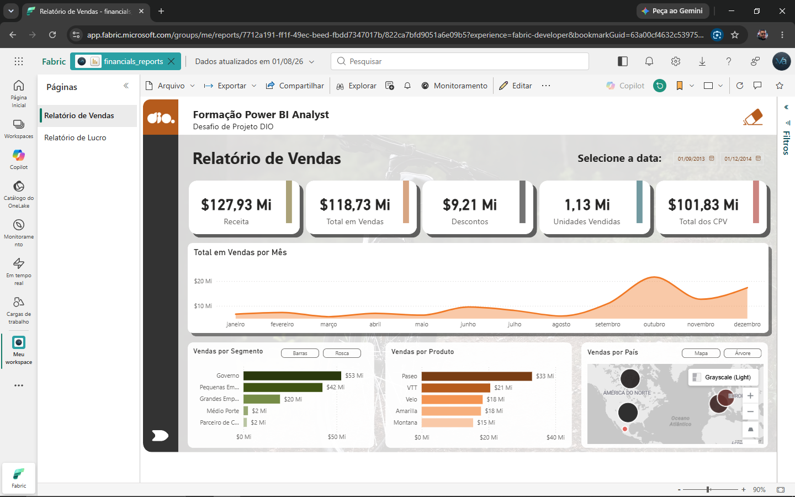
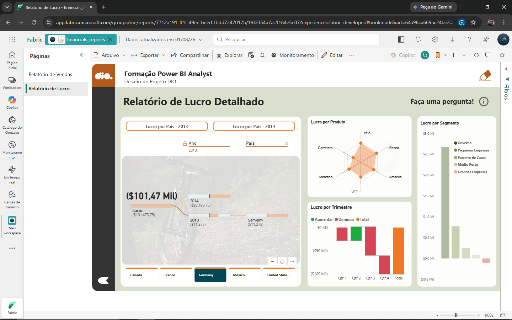

# Relatório Financeiro - Power BI

## Descrição

Projeto desenvolvido como desafio da Formação Power BI Analyst da DIO.

O relatório foi elaborado utilizando a base Sample Financials e apresenta indicadores de vendas e lucro com navegação entre páginas, segmentadores e diferentes visuais interativos.

## Recursos

- Power BI Desktop
- Sample Financials
- Cartões de indicadores
- Gráfico de linhas
- Barras
- Radar
- Cascata (Waterfall)
- Mapa
- Segmentadores
- Navegação entre páginas

## Arquivos

- financials_reports.pbix

## Dashboard de Vendas

## Dashboard de Lucro

## Publicação

Relatório publicado no Power BI Service.

## Autor

Lúcio do Vale
